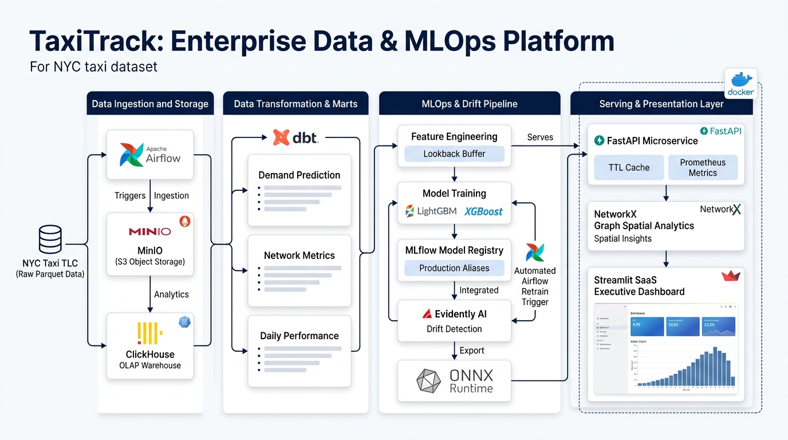
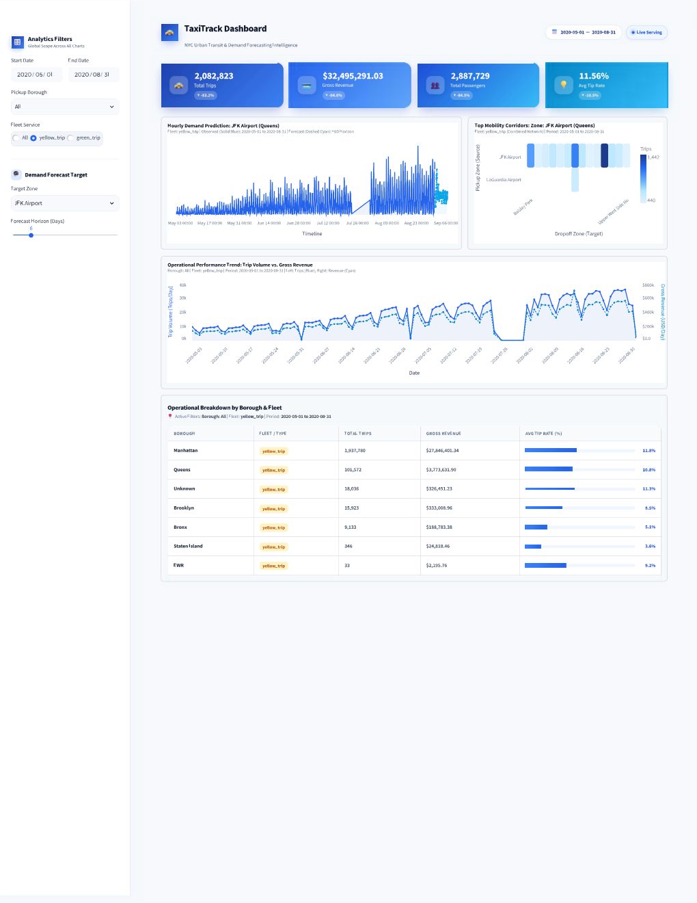
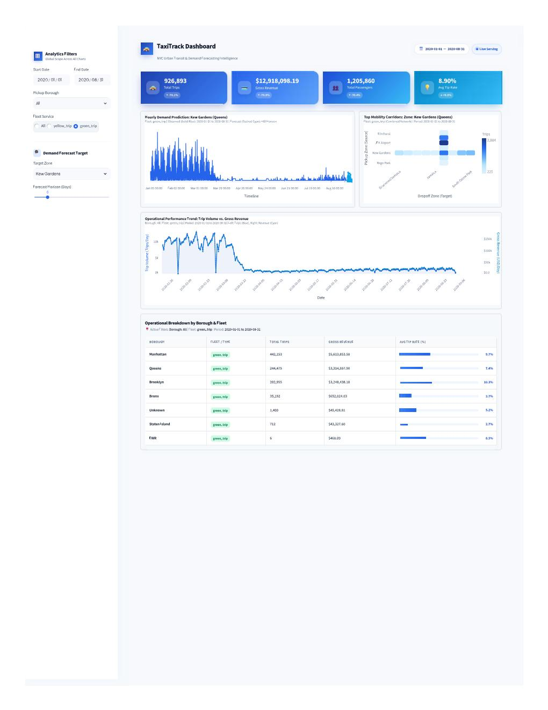
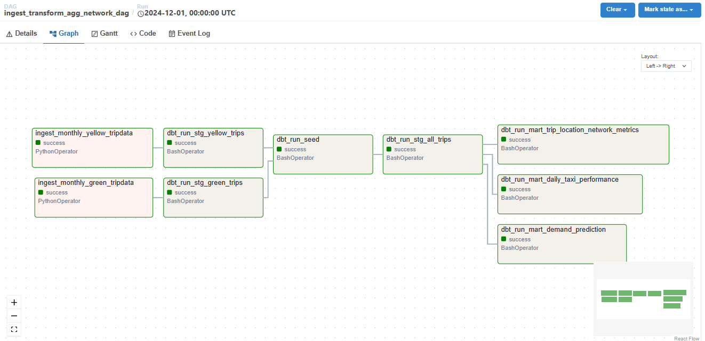

# 🚖 TaxiTrack: Enterprise NYC Taxi Data & MLOps Platform

[](https://www.python.org/)
[](https://fastapi.tiangolo.com/)
[](https://lightgbm.readthedocs.io/)
[](https://onnxruntime.ai/)
[](https://clickhouse.com/)
[](https://airflow.apache.org/)
[](https://www.getdbt.com/)
[](https://min.io/)
[](https://mlflow.org/)
[](https://www.evidentlyai.com/)
[](https://streamlit.io/)
[](https://www.docker.com/)

---

## 🎯 Executive Overview

**TaxiTrack** is an enterprise-grade, full-stack Data Engineering and MLOps platform engineered to transform massive NYC Taxi & Limousine Commission (TLC) transit data into real-time operational intelligence and sub-millisecond predictive insights.

Processing millions of trips monthly, the platform combines a modern lakehouse architecture, leak-free machine learning pipelines, continuous data drift observability, high-concurrency API serving, and an executive analytical dashboard:

- **Automated ELT Lakehouse**: Monthly automated Airflow pipelines ingesting Yellow and Green taxi parquet files into MinIO S3 object storage, modeled through dbt into optimized ClickHouse MergeTree analytical marts.
- **Leak-Free Demand Forecasting**: Production GBDT forecasting engine utilizing a specialized **168h Lookback Buffer architecture** that eliminates temporal lookahead peeking and target encoding contamination.
- **Enterprise MLOps & Model Registry**: MLflow model lineage tracking with `@champion` and `@production` aliases, coupled with native **Evidently AI multi-type drift detection** (covariate, concept, data quality) that dynamically triggers Airflow model retraining.
- **Sub-Millisecond Inference**: LightGBM models compiled to **ONNX Runtime**, achieving **0.065 ms P50 latency** and ~8,900 requests/second throughput for instant API serving.
- **Spatial Transit Intelligence**: NetworkX graph algorithms mapping 61,000+ directed transit flows to extract PageRank influence, betweenness bottlenecks, and top mobility corridors.
- **Executive SaaS Dashboard**: A unified Streamlit interface adhering to a modern SaaS Blue design system with universal filter propagation, independent dual-axis trends, and responsive borough/fleet analytics.

---

## 🏗️ System Architecture



The TaxiTrack platform is structured into four decoupled, containerized tiers:

```
┌──────────────────────────────────────────────────────────────────────────────────────────────────┐
│ 1. DATA INGESTION & STORAGE LAYER                                                                │
│    NYC Open Data TLC (Yellow & Green Parquet)                                                    │
│    ├── Apache Airflow: Scheduled ingestion, backfill validation, Cairo Timezone (Africa/Cairo)   │
│    ├── MinIO: S3-compatible raw data lake for immutable parquet storage                          │
│    └── ClickHouse: High-performance columnar OLAP data warehouse                                 │
└─────────────────────────────────────────────┬────────────────────────────────────────────────────┘
                                              │
┌─────────────────────────────────────────────▼────────────────────────────────────────────────────┐
│ 2. DATA TRANSFORMATION & MODELING (dbt)                                                          │
│    ClickHouse Transformations: Staging ➔ Intermediate ➔ Analytical Marts                         │
│    ├── mart_demand_prediction: Hourly demand aggregations by zone, borough, and service          │
│    ├── mart_trip_location_network_metrics: Origin-Destination flows, durations, and distances    │
│    └── mart_daily_taxi_performance: Daily KPIs, passenger counts, gross revenues, and tip rates  │
└─────────────────────────────────────────────┬────────────────────────────────────────────────────┘
                                              │
┌─────────────────────────────────────────────▼────────────────────────────────────────────────────┐
│ 3. MLOps, DRIFT OBSERVABILITY & MODEL REGISTRY                                                   │
│    ├── Lookback Buffer Feature Engineering: 168h buffer window (strictly shift >= 24h)           │
│    ├── Strategy & Factory Pattern: LightGBM & XGBoost forecasters                                │
│    ├── Evidently AI Engine: Multi-type drift detection (DataDrift, TargetDrift, DataQuality)     │
│    ├── Airflow Retrain Trigger: Automated drift-gated retraining DAGs                            │
│    ├── MLflow Registry: Model provenance, artifact tracking, @champion / @production aliases    │
│    └── ONNX Runtime Export: Optimized model graph for sub-millisecond serving                    │
└─────────────────────────────────────────────┬────────────────────────────────────────────────────┘
                                              │
┌─────────────────────────────────────────────▼────────────────────────────────────────────────────┐
│ 4. SERVING, SPATIAL ANALYTICS & EXECUTIVE PRESENTATION                                           │
│    ├── FastAPI Microservice: High-concurrency async endpoints with in-memory TTLCache            │
│    ├── Prometheus Metrics: Real-time request latencies, drift alerts, and active model versions  │
│    ├── NetworkX Spatial Engine: Graph centrality metrics and top origin-destination corridors    │
│    └── Streamlit Executive Dashboard: Plus Jakarta Sans UI, global filter scope, Altair charts   │
└──────────────────────────────────────────────────────────────────────────────────────────────────┘
```

---

## 🖥️ Executive Operational Dashboard

The Streamlit UI (`src/ui/app.py`) provides transit executives and fleet managers with an interactive, responsive command center built around a **SaaS Blue design system** (strict light mode `#F8FAFC`, Google Font *Plus Jakarta Sans*, and zero red default accents):



### Key Dashboard Capabilities

1. **Global Scope Filter Engine**: Universal date bounds, pickup boroughs, fleet service types (`All`, `yellow_trip`, `green_trip`), and target taxi zones synchronize across every visual element simultaneously.
2. **Blue Gradient KPI Cards**: Four executive cards (Total Trips, Gross Revenue USD, Total Passengers, Avg Tip Rate) featuring frosted-glass icon containers and period-over-period percentage delta pills.
3. **Independent Dual-Axis Operations Trend**: An interactive Altair chart comparing daily trip volume (Royal Blue `#2563EB`) against gross revenue (Cyan `#0EA5E9`) with zero-collision domain axes, crosshair tooltips, and pan/zoom capability.
4. **Hourly Demand Prediction**: Historical observed demand seamlessly overlaid with forward-looking ONNX predictions (up to +30 day horizons) for any of NYC's 261 taxi zones.
5. **Top Mobility Corridors Heatmap**: Origin-destination passenger flow density matrix dynamically filtered by active pickup zone and date range.
6. **Borough & Fleet Breakdown**: Responsive analytical breakdown table with fleet badges and custom Royal Blue gradient progress bars for average tip percentages.



---

## ⚡ High-Performance Serving Benchmark (ONNX Runtime)

The production LightGBM demand forecaster is exported to the **ONNX (Open Neural Network Exchange)** format, providing hardware-accelerated, thread-safe inference without requiring Python ML framework runtime overhead.

```
+-------------------------------------------------------------------------+
|                  ONNX RUNTIME LATENCY BENCHMARK (500 RUNS)              |
+-------------------+--------------------+------------------+-------------+
|   P50 Latency     |    P95 Latency     |   P99 Latency    | Throughput  |
|     0.065 ms      |      0.172 ms      |     0.660 ms     | ~8,900 rps  |
+-------------------+--------------------+------------------+-------------+
```

* **Numerical Parity Verified**: Maximum absolute delta between native LightGBM and ONNX Runtime predictions is **$4.05 \times 10^{-6}$** ($\le 10^{-4}$ threshold).
* **Model Size**: Compact 5.04 MB serialized ONNX graph deployed directly in the lightweight `model-api` container.

---

## 🧠 Machine Learning & MLOps Architecture

### 1. Data Leakage Resolution & Lookback Buffer Architecture

In demand forecasting pipelines, improper cross-validation and feature generation frequently introduce severe data leakage that inflates validation metrics while causing production failure. TaxiTrack implements a **leak-free architecture**:

```
                              Cutoff Date
                                   │
      Train Data (<= Cutoff)       │        Validation Holdout (> Cutoff)
───────────────────────────────────┼─────────────────────────────────────────────►
[======== df_train ===============]│
                 [== 168h Buffer ==│======== df_val_buf =========================]
                                   │
                                   │  Trim Buffer:
                                   │  X_val, y_val strictly > Cutoff
```

- **Diagnosis of Historical Discrepancies**:
  - *2025 Normalcy Baseline*: Average demand of ~28 trips/zone-hour yielded an MAE of **9.7199** ($\text{WAPE} \approx 34.7\%$).
  - *May–June 2020 Holdout*: Average demand collapsed by 87% to **5.32 trips/zone-hour** due to COVID-19 lockdowns. An uncorrected MAE of 2.19 appeared artificially low, yet its **WAPE was 41.22%** (higher relative percentage error).
- **Eliminated Data Leakages**:
  1. **Rolling Lookahead Peeking**: Enforced `shift_horizon = min(lag_hours) = 24h` so rolling statistics strictly look $\ge 24\text{h}$ into the past, preventing 23-hour future lookaheads in day-ahead forecasting.
  2. **Target Encoding Contamination**: Completely eliminated `group_mean_trips` (which leaked validation targets into training). LightGBM's native categorical histogram binning handles spatial zone relationships without bias.
  3. **Artificial Lag Imputation**: Preserved natural `NaN`s in lag columns, enabling gradient-boosted decision trees to optimize missing-value split branches natively.
- **Lookback Buffer Pattern (`prepare_train_val_split`)**:
  - Partitions training data ($\le \text{cutoff}$) and validation data with a 168-hour lookback buffer ($> \text{cutoff} - 168\text{h}$).
  - Fits feature engineering transformers strictly on training data.
  - Transforms train and validation independently, then trims the 168h buffer so validation records strictly cover $> \text{cutoff}$.

---

### 2. MLflow Model Registry Tracking (`taxi-demand-forecaster`)

All model iterations are logged, versioned, and tracked in the central MLflow Model Registry:

| Version             | Model Description                   | Training / Holdout Window           | Architecture & Leakage Status                                                      |       MAE       |     WAPE (%)     |  $R^2$ Score  | Deployment Status                      |
| :------------------ | :---------------------------------- | :---------------------------------- | :--------------------------------------------------------------------------------- | :--------------: | :--------------: | :--------------: | :------------------------------------- |
| **Version 1** | Legacy 2025 Baseline                | 2022–2024 /**2025**          | Pre-trained model (rolling features commented out)                                 | **9.7199** |      ~34.7%      |        —        | Historical Benchmark                   |
| **Version 2** | Initial 2020 Run                    | 2019–2020 /**May–Jun 2020** | ⚠️$T-1$ rolling shift (lookahead) + target encoding in `fit()`               | **2.1942** |      41.22%      |      0.7957      | Diagnosed & Deprecated                 |
| **Version 3** | Clean Model (w/ target enc)         | 2019–2020 /**May–Jun 2020** | $\ge 24\text{h}$ shift + train-only fit, but with `group_mean_trips`           | **2.6425** |      49.64%      |      0.7327      | Intermediate Version                   |
| **Version 4** | **Production Lookback Model** | 2019–2020 /**May–Jun 2020** | **Pure Lookback Buffer**: Native GBDT categories & natural `NaN` branching | **2.5988** | **48.82%** | **0.7196** | 🚀**Production (`@champion`)** |

*Removing stale target encodings in Version 4 directly reduced MAE from 2.6425 to **2.5988** and dropped WAPE from 49.64% to **48.82%**.*

---

### 3. Evidently AI Multi-Type Drift Monitoring

Continuous data observability is implemented via `src/ml/monitoring/detector.py` using native Evidently AI presets:

- **Data Drift Preset**: Evaluates feature distribution and covariate drift across numeric and categorical variables using Wasserstein distance and Kolmogorov-Smirnov tests.
- **Target Drift Preset**: Monitors concept drift on observed `total_trips`.
- **Data Quality Preset**: Detects missing-value spikes and unexpected schema shifts.
- **Artifacts Generated**:
  - Interactive Visual Dashboard: `reports/drift/evidently_drift_report.html`
  - Machine-Readable Summary: `reports/drift/drift_summary.json`

---

## 🔄 Automated Airflow Orchestration (Cairo Timezone Standard)

All Airflow DAGs, Docker containers, and database timestamps are strictly standardized to **`Africa/Cairo`** timezone (`TZ=Africa/Cairo`), ensuring synchronized scheduling and log correlation:



### Production DAGs:

1. **`elt_pipeline_dag.py`** (`@monthly`):
   - Ingests raw monthly yellow and green taxi trip parquet files in parallel.
   - Stages data in MinIO object storage.
   - Executes the dbt build chain: staging models (`stg_yellow_trips`, `stg_green_trips`) ➔ intermediate (`stg_all_trips`) ➔ analytical marts (`mart_demand_prediction`, `mart_trip_location_network_metrics`, `mart_daily_taxi_performance`).
2. **`ml_drift_monitoring_dag.py`** (`@weekly`):
   - Computes data and target drift across the operational window using `DriftMonitoringPipeline`.
   - Evaluates drift metrics with a `ShortCircuitOperator` alert gate.
   - If drift exceeds threshold, automatically triggers `ml_retrain_dag` via the Airflow Python API.
3. **`ml_retrain_dag.py`** (Manual / Triggered):
   - Dedicated retraining pipeline executing feature engineering with the 168h Lookback Buffer.
   - Retrains the LightGBM forecaster, exports updated ONNX model graphs, and registers the new version in MLflow.
   - Promotes the winning model version with modern `@champion` and `@production` aliases.

---

## 🌐 High-Performance Serving API (`src/api/`)

The model serving layer is a lightweight, asynchronous FastAPI microservice featuring dependency injection, in-memory TTL caching, and robust ClickHouse CTE aggregations.

### API Architecture Highlights:

- **Lifespan Model Loader**: Automatically discovers and loads the `@champion` or `@production` ONNX model and feature engineering pipeline directly from MLflow S3 artifacts, with local disk fallback.
- **Cache-Aside Pattern (`TTLCache`)**: High-frequency queries (analytics overview, timeseries, and network centrality graphs) are cached in-memory with automatic TTL expiration.
- **Clean ClickHouse CTE Aggregations**: Resolves ClickHouse `ILLEGAL_AGGREGATION` bugs by computing base sums (`trips_cnt`, `rev_val`, `tips_val`) in a first-pass Common Table Expression before deriving ratio metrics (`avg_tip_rate`).
- **Prometheus Observability**: Instruments request volume, latency distributions, active drift status, and deployed model versions.

### Core Endpoints:

| Method  | Endpoint                       | Description                                                               |
| ------- | ------------------------------ | ------------------------------------------------------------------------- |
| `GET` | `/health`                    | Service health, active ONNX session, and loaded feature engineer status   |
| `GET` | `/metrics`                   | Prometheus metrics scrape endpoint                                        |
| `GET` | `/api/analytics/overview`    | High-level KPIs (trips, revenue, passengers, tip rate) with period deltas |
| `GET` | `/api/analytics/timeseries`  | Daily and monthly trend aggregations                                      |
| `GET` | `/api/analytics/breakdown`   | Multi-dimensional borough and fleet breakdown with tip percentages        |
| `GET` | `/api/forecast/predict`      | Forward-looking ONNX hourly demand predictions up to +30 days             |
| `GET` | `/api/forecast/historical`   | Historical observed demand timeseries for validation overlay              |
| `GET` | `/api/forecast/zones`        | Distinct modeled taxi zone IDs and borough metadata                       |
| `GET` | `/api/network/top-corridors` | Ranked origin-destination transit flows filtered by zone and date         |
| `GET` | `/api/network/centrality`    | Graph centrality metrics (PageRank, betweenness, in/out degree)           |

---

## 🕸️ Spatial Transit Network Intelligence (NetworkX)

By modeling NYC transit as a directed, weighted graph (262 zone nodes, 61,782 trip edges), TaxiTrack provides deep spatial mobility insights:

- **Top Inbound Hubs (Trip Attractors)**: JFK Airport, Times Square, TriBeCa, Kips Bay.
- **Top Outbound Hubs (Trip Generators)**: JFK Airport, Midtown South, Times Square, Union Square.
- **Net Attractors (Demand > Supply)**: Newark Airport, Staten Island residential corridors, Broad Channel.
- **Critical Transit Bottlenecks (High Betweenness)**: Governor's Island, Great Kills, Astoria Park.
- **Most Influential Hubs (PageRank)**: Upper East Side (North & South), Midtown Center, Murray Hill.

---

## 📁 Project Structure

```
TaxiTrack/
├── airflow/
│   └── dags/
│       ├── elt_pipeline_dag.py           # Monthly ingestion & dbt dimensional mart pipeline
│       ├── ml_drift_monitoring_dag.py    # Evidently AI drift detection & retrain trigger
│       └── ml_retrain_dag.py             # Model retraining, ONNX export & MLflow alias promotion
├── configs/
│   └── ml_config.yaml                    # Machine learning hyperparameters & feature config
├── dbt/
│   ├── dbt_project.yml
│   └── models/
│       ├── staging/                      # stg_green_trips, stg_yellow_trips
│       ├── intermediate/                 # stg_all_trips (unified schema)
│       └── marts/                        # demand_prediction, network_metrics, daily_performance
├── docker/
│   ├── airflow/                          # Airflow webserver & scheduler Dockerfile
│   ├── api/                              # FastAPI ONNX model serving Dockerfile
│   ├── mlflow/                           # MLflow Tracking Server Dockerfile
│   ├── monitoring/                       # Prometheus configuration (prometheus.yml)
│   ├── postgres/                         # Airflow & MLflow backend database init
│   └── streamlit/                        # Streamlit executive UI Dockerfile
├── images/
│   ├── architecture_diagram.png          # System architecture diagram
│   ├── dashboard_overview.png            # Streamlit dashboard overview
│   ├── dashboard_fleet_filter.jpg        # Fleet filtering & zone analysis screenshot
│   └── airflow.png                       # Airflow DAG pipeline graph
├── models/
│   ├── lightgbm_model.onnx               # Optimized production ONNX model
│   └── feature_engineer.pkl             # Serialized production feature pipeline
├── reports/
│   └── drift/                            # Evidently AI HTML reports & JSON summaries
├── src/
│   ├── api/                              # FastAPI Serving Application
│   │   ├── dependencies.py               # Dependency injection (ClickHouse, ONNX, Cache)
│   │   ├── main.py                       # App lifespan, route mounting & Prometheus
│   │   ├── metrics.py                    # Prometheus counter and histogram instruments
│   │   ├── routers/                      # analytics.py, forecast.py, network.py
│   │   ├── schemas/                      # Pydantic request/response models
│   │   └── services/                     # AnalyticsService, ForecastService, NetworkService
│   ├── core/
│   │   ├── config.py                     # Docker-aware infrastructure settings (MinIO, MLflow, DB)
│   │   └── ml_config.py                  # Pydantic ML settings parsed from ml_config.yaml
│   ├── data/                             # Data ingestion & parquet lakehouse loaders
│   ├── ml/                               # Domain-Driven ML & MLOps Package
│   │   ├── data/                         # ClickHouseFeatureRepository
│   │   ├── features/                     # TemporalFeatureEngineer (Lookback Buffer)
│   │   ├── graph/                        # SpatialNetworkAnalyzer (NetworkX)
│   │   ├── models/                       # ForecasterFactory, LightGBMForecaster, XGBoostForecaster
│   │   ├── monitoring/                   # EvidentlyDriftDetector & DriftMonitoringPipeline
│   │   ├── serving/                      # ONNXModelExporter & benchmark suite
│   │   ├── tracking/                     # MLflowExperimentTracker (Alias management)
│   │   └── pipeline.py                   # MLTrainingPipeline orchestrator
│   └── ui/                               # Streamlit SaaS Executive Dashboard
│       ├── api_client.py                 # Typed HTTP client for FastAPI backend
│       ├── app.py                        # Main dashboard application & global filter engine
│       └── components/                   # KPI cards, performance chart, forecast chart, table
├── tests/
│   ├── unit/                             # 9/9 passing service & logic tests
│   └── integration/                      # 11/11 passing API endpoint & integration tests
├── docker-compose.yml                    # Multi-profile microservice composition
├── pyproject.toml                        # Project dependencies & build metadata
├── update.md                             # Comprehensive technical update changelog
└── README.md
```

---

## 🚀 Getting Started

### Prerequisites

- **Python**: `>= 3.10, < 3.13`
- **Docker & Docker Compose**: v2.20+
- **Memory**: $\ge 8\text{ GB}$ recommended for container stack

### 1. Environment Configuration

Copy the environment template and inspect connection parameters:

```bash
cp .env.example .env
```

### 2. Launch Services with Docker Compose

The platform utilizes **Docker Compose Profiles** for modular execution:

```bash
# Option A: Start Core Data Platform (Airflow, MinIO, ClickHouse, Postgres)
docker compose --profile data up -d

# Option B: Start Data Platform + MLflow MLOps Stack
docker compose --profile ml up -d

# Option C: Start Complete Serving Stack (FastAPI, Streamlit, Prometheus)
docker compose --profile serving up -d

# Option D: Start All Enterprise Services
docker compose --profile all up -d
```

### 3. Service Access Reference

| Service                        | URL                                                     | Default Credentials         | Purpose                                |
| ------------------------------ | ------------------------------------------------------- | --------------------------- | -------------------------------------- |
| **Streamlit Dashboard**  | [http://localhost:8501](http://localhost:8501)           | *None*                    | Executive analytics command center     |
| **FastAPI Swagger Docs** | [http://localhost:8000/docs](http://localhost:8000/docs) | *None*                    | Interactive API specification          |
| **Airflow Webserver**    | [http://localhost:8080](http://localhost:8080)           | `airflow` / `airflow`   | Ingestion & MLOps DAG orchestration    |
| **MLflow Registry**      | [http://localhost:5000](http://localhost:5000)           | *None*                    | Model tracking &`@champion` registry |
| **MinIO Console**        | [http://localhost:9001](http://localhost:9001)           | `admin` / `password123` | S3 raw parquet object lake             |
| **ClickHouse HTTP**      | [http://localhost:8123](http://localhost:8123)           | `default` / *empty*     | Columnar OLAP warehouse                |
| **Prometheus**           | [http://localhost:9090](http://localhost:9090)           | *None*                    | Service & inference metric monitoring  |

---

## 🧪 Testing & Verification

The repository includes a comprehensive automated test suite spanning unit logic and API integration:

```bash
# Run the complete test suite
pytest tests/
```

```
tests/unit/test_analytics_service.py   ...  [Passing]
tests/unit/test_forecast_service.py    ...  [Passing]
tests/unit/test_network_service.py     ...  [Passing]
tests/integration/test_analytics_api.py .... [Passing]
tests/integration/test_forecast_api.py  .... [Passing]
tests/integration/test_network_api.py   ...  [Passing]

======================= 20 passed in 2.14s =======================
```

---

## 🛠️ Technology Stack

| Domain                      | Technology               | Purpose                                                                  |
| --------------------------- | ------------------------ | ------------------------------------------------------------------------ |
| **Data Lakehouse**    | MinIO (S3)               | Scalable object storage for raw NYC TLC parquet datasets                 |
| **OLAP Warehouse**    | ClickHouse               | Fast MergeTree columnar storage for dimensional marts                    |
| **Transformations**   | dbt (ClickHouse adapter) | Staging, intermediate, and dimensional modeling                          |
| **Orchestration**     | Apache Airflow           | Scheduled data pipelines & drift-triggered retraining                    |
| **ML Framework**      | LightGBM & XGBoost       | Gradient boosted decision trees for time-series demand forecasting       |
| **Model Registry**    | MLflow 2.20+             | Experiment provenance, artifact store, and modern`@production` aliases |
| **Observability**     | Evidently AI             | Covariate data drift, target drift, and data quality presets             |
| **Inference Serving** | ONNX Runtime             | High-throughput sub-millisecond model graph execution                    |
| **API Backend**       | FastAPI & Uvicorn        | Asynchronous RESTful microservice with in-memory TTL caching             |
| **Spatial Graph**     | NetworkX                 | Origin-destination transit network centrality & flow metrics             |
| **User Interface**    | Streamlit & Altair       | SaaS Blue executive dashboard with interactive dual-axis trends          |
| **Metrics**           | Prometheus               | Real-time endpoint latencies, request rates, and model health            |
| **Packaging**         | Docker & Compose         | Multi-container microservice isolation and reproducible environments     |

---

## 📄 License & Authors

- **Author**: Ziad Ashraf ([ziadashraf98765@gmail.com](mailto:ziadashraf98765@gmail.com))
- **License**: Apache License 2.0
- **Data Source**: [NYC Taxi &amp; Limousine Commission (TLC) Trip Record Data](https://www.nyc.gov/site/tlc/about/tlc-trip-record-data.page)
