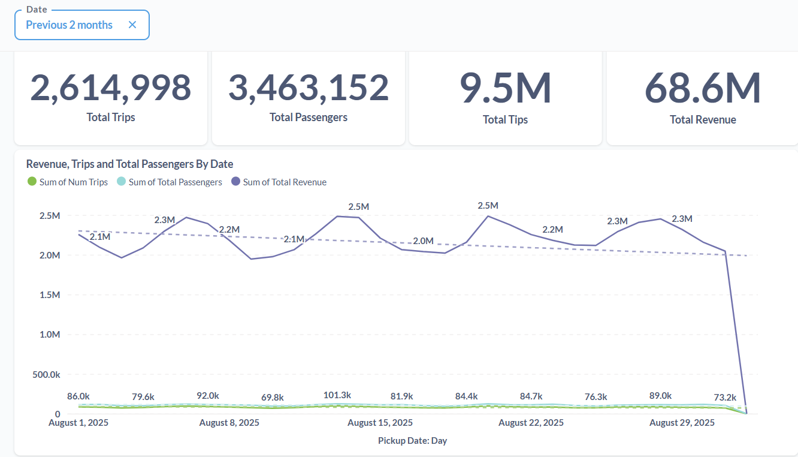

# 🚖 TaxiTrack: End-to-End NYC Taxi Data Platform


## 🎯 Overview

**TaxiTrack** is a full-stack data platform combining modern data engineering practices with advanced machine learning to transform NYC taxi data into business intelligence. The system processes millions of trips monthly, delivering:

- **Predictive Analytics**: ML-powered demand forecasting with iterative multi-step predictions
- **Network Intelligence**: Graph-based analysis revealing demand hubs and bottlenecks
- **Business Dashboards**: Real-time operational metrics and KPI tracking
- **Automated Pipelines**: Orchestrated ELT workflows with incremental processing
---

## 🏗️ Architecture


```

┌─────────────────────────────────────────────────────────────┐
│  Data Sources: NYC Open Data (Green & Yellow Taxi Trips)    │
└──────────────────────┬──────────────────────────────────────┘
                       ↓
┌─────────────────────────────────────────────────────────────┐
│  Airflow Orchestration (@monthly schedule)                  │
│  • Automated parquet downloads                              │
│  • Parallel ingestion (green + yellow)                      │
│  • dbt transformation triggering                            │
└──────────────────────┬──────────────────────────────────────┘
                       ↓
┌─────────────────────────────────────────────────────────────┐
│  Storage Layer                                              │
│  • MinIO: Raw parquet object storage                        │
│  • ClickHouse: Data warehouse (staging → marts)             │
└──────────────────────┬──────────────────────────────────────┘
                       ↓
┌─────────────────────────────────────────────────────────────┐
│  dbt Transformation (ELT)                                   │
│  • Staging: stg_green_trips, stg_yellow_trips               │
│  • Intermediate: stg_all_trips (unified)                    │
│  • Marts: demand_prediction, network_metrics, performance   │
└──────────────────────┬──────────────────────────────────────┘
                       ↓
        ┌──────────────┴───────────────┐
        ↓                              ↓
┌──────────────────┐         ┌────────────────────┐
│  ML Pipeline     │         │  BI & Dashboards   │
│  • LightGBM      │         │  • Metabase        │
│  • Feature Eng   │         │  • Streamlit App   │
│  • Forecasting   │         │  • NetworkX        │
└──────────────────┘         └────────────────────┘
```

---

## ✨ Core Features
### 1. **Automated Data Ingestion**
- **Monthly orchestration** via Airflow DAG
- **Parallel processing** of green and yellow taxi datasets
- **MinIO integration** for efficient object storage
- **ClickHouse batching** with deduplication logic
- **Incremental loading** to prevent redundant processing

### 2. **dbt Transformation Layer**
- **Modular SQL models** with staging → intermediate → mart pattern
- **Incremental materialization** for performance optimization
- **Built-in data quality tests** ensuring integrity
- **Dimensional enrichment** with zone/borough lookups
- **Feature engineering** for ML readiness

### 3. **Demand Forecasting System**
- **LightGBM gradient boosting** with categorical support
- **Iterative multi-step predictions** using lag features
- **Group-based modeling** (zone × borough × service type)
- **Temporal features**: hour, day, cyclical encoding, rush hour flags
- **Rolling statistics**: 24h and 168h windows
- **Confidence intervals**: ±20% prediction bands

### 4. **Network Analysis**
- **Graph-based trip flow modeling** with NetworkX
- **Centrality metrics**: degree, betweenness, closeness, PageRank
- **Hub identification**: inbound attractors vs outbound generators
- **Bottleneck detection** for infrastructure planning
- **Influence scoring** weighted by trip volume

### 5. **Business Intelligence**
- **Metabase dashboards** tracking:
  - Total trips, revenue, fare amounts
  - Location performance comparisons
  - Time-series trends (daily/monthly)
  - Monitor the performance of ingestion
- **Streamlit web app** for interactive forecasting
- **CSV exports** for external analysis

---

## 🎯 Machine Learning: Demand Forecasting

### Model Architecture

**Algorithm**: LightGBM with native categorical encoding

**Training Configuration**:
- 5,000 estimators with early stopping
- Learning rate: 0.05
- 500 leaf nodes for complexity
- Multi-core parallelization

**Feature Engineering**:
```
Temporal Features:
├── Hour of day (0-23)
├── Day of week (0-6)
├── Weekend indicator
├── Rush hour flags (AM/PM)
└── Cyclical encoding (sin/cos)

Lag Features:
├── 24-hour lag (yesterday same hour)
└── 168-hour lag (last week same hour)

Rolling Statistics:
├── 24-hour rolling mean/std
└── 168-hour rolling mean/std

Group Features:
├── Zone × Borough × Service encoding
└── Group density clustering
```

### Performance Metrics

| Dataset | MAE (trips/hour) | Improvement |
|---------|------------------|-------------|
| Training | 8-12 |  |
| Test | 8-12 | **60% better than Baseline** |

**Prediction Capabilities**:
- Horizons: 1 to 1,500 hours ahead
- Latency: <100ms per group
- Groups covered: 76 high-volume combinations

### Iterative Forecasting Process

```python
# Pseudocode representation
for each future hour:
    1. Extract temporal features (hour, day, etc.)
    2. Apply lag features (using previous predictions)
    3. Calculate rolling statistics
    4. Generate prediction
    5. Use prediction as input for next step
    6. Add ±20% confidence interval
```

---

[](https://drive.google.com/file/d/1Zr-3G8kGJxDCwWvYoIx4CBjtSuD6YRYy/view?usp=sharing)

## 🕸️ Network Analysis Insights

### Graph Construction
- **Nodes**: 262 pickup/dropoff locations
- **Edges**: 61,782 directed trip flows
- **Weights**: Trip count, distance, duration, fares

### Key Findings

**Top Inbound Hubs** (Trip Attractors):
1. JFK Airport
2. Times Square
3. TriBeCa
4. Kips Bay

**Top Outbound Hubs** (Trip Generators):
1. JFK Airport
2. Midtown South
3. Times Square
4. Union Square

**Net Attractors** (Demand > Supply):
- Newark Airport
- Staten Island neighborhoods
- Broad Channel

**Critical Bottlenecks** (High Betweenness):
- Governor's Island
- Great Kills
- Astoria Park

**Most Influential** (PageRank):
- Upper East Side (North & South)
- Midtown Center
- Murray Hill

### Business Applications
- **Driver allocation** to underserved net attractors
- **Dynamic pricing** at bottleneck locations
- **Infrastructure planning** around high-centrality zones
- **Revenue optimization** focusing on influential areas

---
## 🕸️ BI Insights

[](https://drive.google.com/file/d/1Hk0loo5H1AAGrw7-_CbKB8pXqzPHMOCp/view?usp=sharing)
---



- The number of trips **increased at the start of the week**, peaking around **Wednesday**, and then gradually decreased during the **weekend**.
- This pattern suggests **higher weekday demand**, likely driven by commuters and regular city traffic.


- **Manhattan and Queens** generated the most revenue last month.
- Notably, **Manhattan** accounted for **60%** of revenue trips in August, highlighting it as the primary revenue driver.
---

## 📊 Project Impact

### Data Processing Scale
- **78% faster batch ingestion** achieved, reducing pipeline runtime
- **4.5M+ records** processed monthly through automated pipelines
- **250M+ records** transformed using dbt
- **262 unique locations** analyzed across NYC boroughs
- **76 high-volume groups** modeled for demand forecasting
- **61,782 trip flows** mapped in network analysis

### Performance Achievements
- **60% MAE improvement** over baseline forecasting models
- **<100ms prediction latency** for real-time demand forecasts
- **5-10 minutes** training time for 75+ location groups
- **<5 seconds** dashboard load time with intelligent caching

### Business Value
- **Hourly demand predictions** up to 1,500 hours into the future
- **Real-time KPI tracking** across all NYC boroughs
- **Network bottleneck identification** for strategic planning
- **Automated monthly ingestion** with zero-downtime updates

---

## 🚀 Getting Started

### Prerequisites
```bash
Python >= 3.8
Docker & Docker Compose
ClickHouse database
MinIO object storage
```

### Installation

```bash
# Clone repository
git clone https://github.com/Ziadashraf301/TaxiTrack.git
cd TaxiTrack

# Start infrastructure services
docker-compose up -d
```

### Running the Pipeline

**1. Automated Monthly Ingestion (Airflow)**:
```bash
# Airflow automatically triggers monthly
```

**2. dbt Transformations**:
```bash
#Airflow automatically runs it
```

**3. Train ML Models**:
```bash
python demand_prediction/model_dev/run_pipeline.py
```

**4. Launch Streamlit Dashboard**:
```bash
streamlit run demand_prediction/streamlit_app/app.py
```

**5. Access Metabase**:
```
http://localhost:3000
```

---

## 📁 Project Structure

```
TaxiTrack/
├── airflow/src/              # Data ingestion modules
│   ├── main_run_ingestion.py
│   ├── ingestor.py
│   ├── downloader.py
│   ├── db_utils.py
│   └── logger.py
├── airflow/dags/
│   └── ELT.py             # Airflow orchestration
├── dbt/
│   ├── models/
│   │   ├── staging/       # stg_green_trips, stg_yellow_trips
│   │   ├── intermediate/  # stg_all_trips
│   │   └── marts/         # demand_prediction, network_metrics
│   └── seeds/             # taxi_zone_lookup
├── demand_prediction/
│   ├── model_dev/         # ML training pipeline
│   │   ├── run_pipeline.py
│   │   ├── data_loader.py
│   │   ├── feature_engineer.py
│   │   ├── forecast.py
│   │   └── config.py
│   └── streamlit_app/     # Interactive dashboard
│       ├── app.py
│       ├── forecaster_manager.py
│       └── visualization.py
├── network_location_demand_analysis/      # Graph-based analysis
├── docker-compose.yml
└── README.md
```

---

## 🛠️ Tech Stack

| Component | Technology | Purpose |
|-----------|-----------|---------|
| **Orchestration** | Airflow | Workflow scheduling |
| **Storage** | MinIO | Raw parquet objects |
| **Warehouse** | ClickHouse | OLAP data warehouse |
| **Transformation** | dbt | ELT modeling |
| **ML Framework** | LightGBM | Gradient boosting |
| **Web App** | Streamlit | Interactive UI |
| **Dashboards** | Metabase | Business intelligence |
| **Network Analysis** | NetworkX | Graph algorithms |
| **Containerization** | Docker | Service isolation |

---

## 📊 Data Models

### Staging Layer
- `stg_green_trips`: Cleaned green taxi data
- `stg_yellow_trips`: Cleaned yellow taxi data

### Intermediate Layer
- `stg_all_trips`: Unified trip data with zone enrichment

### Mart Layer
- `mart_demand_prediction`: Hourly aggregations by zone/borough/service
- `mart_trip_location_network_metrics`: Trip flows with distances/durations
- `mart_daily_taxi_performance`: Daily KPIs by borough/service

---

## 🔧 Configuration

### ClickHouse Connection
Edit `demand_prediction/model_dev/config.py`:
```python
CLICKHOUSE_CONFIG = {
    "host": "localhost",
    "port": 8123,
    "username": "your_username",
    "password": "your_password",
    "database": "data_warehouse"
}
```

### Airflow DAG Settings
Edit `dags/ELT.py`:
```python
default_args = {
    'owner': 'airflow',
    'retries': 5,
    'schedule_interval': '@monthly',
    'start_date': datetime(2019, 1, 1),
}
```

---

## 📈 Performance Optimization

**Data Loading**:
- 500k row chunks for memory efficiency
- Parallel green/yellow ingestion
- Incremental loads preventing duplicates

**ClickHouse**:
- MergeTree engine with partitioning
- ORDER BY optimized for queries
- Incremental dbt materializations

**ML Pipeline**:
- Multi-core LightGBM training
- Early stopping (50 rounds)
- Chunked garbage collection

**Streamlit**:
- 300-second cache TTL
- Lazy forecaster initialization
- Optimized Altair visualizations

---

## 🙏 Acknowledgments

Built with:
- **LightGBM** for gradient boosting
- **dbt** for SQL transformations
- **Streamlit** for interactive dashboards
- **ClickHouse** for data warehousing
- **NetworkX** for graph analysis
- **NYC Open Data** for taxi datasets

---