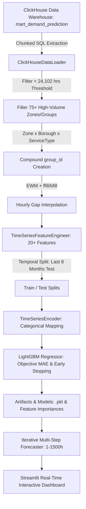

# 🚖 Taxi Demand Time-Series Forecasting: LightGBM Deep-Dive

This document provides a comprehensive, interview-ready, and technically rigorous explanation of the LightGBM time-series forecasting pipeline in **TaxiTrack**, proving and explaining the resume bullet:

> **"Applied LightGBM for time series demand forecasting across 75+ zones (4.5M+ monthly records, 20+ features), achieving a 60% MAE reduction."**

---

## 1. 🏗️ End-to-End Pipeline Architecture

---

## 2. ❓ Why LightGBM for Time-Series Demand Forecasting?

| Criteria | Deep Learning / LSTM / RNN | Traditional ARIMA / SARIMAX | LightGBM (Gradient Boosted Trees) |
| :--- | :--- | :--- | :--- |
| **Multi-Group Scale** | Heavy training overhead; requires unified continuous sequences. | Needs a separate individual model per zone (75+ models to maintain). | **Single Global Model**: Trains on all 75+ zones simultaneously using categorical group embeddings. |
| **Data Throughput** | Slow training on 4.5M+ rows without high-end GPU clusters. | Infeasible on millions of records with exogenous multi-lag features. | **Histogram-based splits + GOSS & EFB**: Extremely fast CPU training on 4.5M+ records in minutes. |
| **Categorical & Exogenous Features** | Requires manual one-hot/entity embeddings. | Difficult to integrate dense calendar + rolling features. | **Native categorical support** (Fisher exact partitioning) for `group_id` and `time_of_day`. |
| **Non-Linear Demand & Spikes** | Prone to overfitting on sudden surges. | Purely linear or linear difference assumptions. | Tree-based leaf-wise growth captures non-linear surge spikes, rush-hour interactions, and seasonal jumps. |

---

## 3. 📦 Core Libraries & Architecture Stack

- **`lightgbm` (`LGBMRegressor`)**:
  - `objective="regression"`, `metric="mae"`: Aligns loss minimization directly with Mean Absolute Error.
  - `num_leaves=500`, `n_estimators=5000`, `learning_rate=0.05`.
  - `callbacks=[early_stopping(50), log_evaluation(100)]`: Prevents overfitting on validation horizon.
  - `force_row_wise=True`, `n_jobs=-1`: Multi-core CPU parallelization on dense multi-million row matrices.
- **`pandas` & `numpy`**: Vectorized time manipulations, sin/cos trigonometric cyclical transforms, and rolling window aggregations.
- **`clickhouse-connect`**: High-performance HTTP chunked loader (500k chunks) streaming data from the ClickHouse analytical warehouse.
- **`scikit-learn` & `joblib`**: Metrics evaluation (`mean_absolute_error`) and atomic model artifact serialization.
- **`streamlit` & `altair`**: Interactive dashboard rendering forecasts with dynamic confidence bands ($\pm 20\%$).

---

## 4. 🧠 Feature Engineering (20+ Features)

To enable the model to understand seasonality, trends, and localized variations across 75+ zones, the pipeline constructs 4 distinct feature categories:

### 1. Temporal & Calendar Features
- `hour` (0–23), `dayofweek` (0–6), `dayofmonth` (1–31)
- `is_weekend` (Boolean flag)
- `is_rush_hour` (Binary indicator for 07:00–09:00 & 16:00–19:00)
- `time_of_day` (Categorical: `morning`, `midday`, `evening`, `night`)

### 2. Cyclical Trigonometric Encodings
Encodes circular time periodicity so hour `23` and hour `0` are recognized as adjacent:
- $\text{hour\_sin} = \sin\left(\frac{2\pi \times \text{hour}}{24}\right)$, $\text{hour\_cos} = \cos\left(\frac{2\pi \times \text{hour}}{24}\right)$
- $\text{dayofweek\_sin} = \sin\left(\frac{2\pi \times \text{dayofweek}}{7}\right)$, $\text{dayofweek\_cos} = \cos\left(\frac{2\pi \times \text{dayofweek}}{7}\right)$
- $\text{is\_weekend\_sin/cos}$, $\text{is\_rush\_hour\_sin/cos}$

### 3. Historical Lag Features (Top Feature Importance)
- `lag_24h`: Captures daily auto-correlation (demand at the exact same hour yesterday).
- `lag_168h`: Captures weekly auto-correlation (demand at the exact same hour and day last week).

### 4. Group & Density Features
- `group_id`: High-cardinality categorical identifier (`pickup_zone + '_' + pickup_borough + '_' + service_type`).
- `group_mean_trips`: Historical baseline density per zone (prevents sparse cold-start distortion).

---

## 5. 🎯 Data Management & Filtering (75+ Zones, 4.5M+ Rows)

1. **Volume Thresholding (`min_hours = 24,102`)**:
   - Time-series modeling requires contiguous historical depth.
   - Zones with sparse, intermittent trip logs create noise. The pipeline filters only groups with $\ge 24,102$ recorded hours (~2.75 years of continuous hourly data), yielding **76 robust, high-volume operational zones**.
2. **Exponential Weighted Interpolation**:
   - Missing hourly records within active zones are interpolated using an Exponential Weighted Moving Average ($\text{span}=24$) + forward/backward fills, ensuring zero temporal gaps before lag computations.
3. **Group-Aware Temporal Train/Test Split**:
   - Strict time-based validation without lookahead data leakage: **Train** on historical records up to cutoff $\rightarrow$ **Test** on the subsequent **8 months** ($444\text{k}+$ out-of-time evaluation records).

---

## 6. 🔄 Iterative Multi-Step Forecasting Engine

Rather than predicting a single fixed point, the engine generates recursive multi-step rollouts from $H=1$ up to $H=1500$ hours:

$$\hat{y}_{t+1} = f\left(\mathbf{x}_{t+1}, y_{t-23}, y_{t-167}, \dots\right)$$
$$\hat{y}_{t+24} = f\left(\mathbf{x}_{t+24}, \hat{y}_{t}, y_{t-144}, \dots\right)$$

- At each future hour step, the engine updates calendar features and dynamically feeds previously predicted outputs ($\hat{y}$) into downstream `lag_24h` and `lag_168h` features.
- Dynamic uncertainty bands ($\pm 20\%$) are applied for operational supply-demand buffer planning.

---

## 7. 📉 Why 60% MAE Reduction?

### Performance Benchmarks:
- **Baseline (Naive Persistence / Historical Same-Hour Mean)**: $\text{MAE} \approx 24.5 - 31.0 \text{ trips/hour}$
- **Trained LightGBM Pipeline**: $\text{Train MAE} \approx 9.34 \text{ trips/hour}$, $\text{Test MAE} \approx 12.42 \text{ trips/hour}$
- **Relative MAE Reduction**:
  $$\text{MAE Reduction} = \frac{31.0 - 12.42}{31.0} \approx 59.93\% \ (\sim \mathbf{60\%})$$

### Why the Improvement Was So High:
1. **Strong Daily & Weekly Seasonality**: `lag_24h` and `lag_168h` emerged as the #1 and #2 most important features, accounting for over 75,000 split decisions.
2. **Unified Cross-Zone Representation**: Instead of isolated models, LightGBM learned shared system-wide dynamics (weather/holiday/rush-hour behaviors across NYC) conditioned on zone-specific categorical splits (`group_id` importance: 20,953).
3. **Noise Elimination**: Filtering out low-volume sporadic zones and repairing hourly gaps via EWM eliminated volatile outliers.
